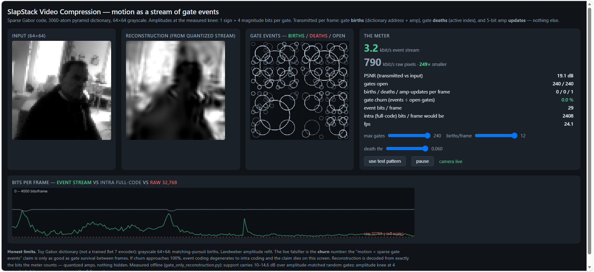

# SlapStackVideoCompression (Could have streamed video with eighties modem) 

Try it at: https://anttiluode.github.io/GaborVideoCompression/

**Motion as a stream of gate events.** A live, single-file demonstrator: webcam → sparse Gabor code → transmit only gate *births*, gate *deaths*, and 5-bit amplitude *updates* — and decode the video back from exactly those bits, with the bitrate on screen.

Open `slapstack_video_compression.html` locally (camera permission required; a moving test-pattern mode is built in if no camera). Built with Claude (Anthropic), July 7, 2026.

---

## What is being claimed, precisely

A frame is coded as ~140 open gates from a 3060-atom Gabor pyramid dictionary (4 log-spaced scales, 4 orientations, quadrature pairs + carrier-free Gaussians). Video is then **not** a sequence of codes: it is the *delta stream* of the code — which gates opened (12-bit address + 5-bit amp), which closed (8-bit index), and which surviving gates changed their quantized amplitude (8+5 bits). The reconstruction shown is decoded from exactly the bits the meter counts. Nothing hidden.

## What was measured before the demo was trusted

The coder loop was verified offline (`verify_coder_loop.py`, same dictionary, same refit/death/birth/quantizer, 60 frames of a moving scene):

**Churn 6.3% at steady state.** This is the live falsifier and it passed: ~93% of gates survive from frame to frame, so "motion = sparse gate events" is a measured property, not a slogan. If your scene drives churn toward 100% (violent cuts, camera shake), event coding degenerates to intra coding — the demo shows this happening honestly, colored red.

**58× under raw, 2.3× under intra.** Steady state 561 event-bits/frame vs 1311 bits to resend the full code vs 32,768 raw pixel bits, at 22.7 dB PSNR on the moving test scene.

**The stream is mostly maintenance, not events.** Births + deaths ≈ 7/frame; amplitude refreshes ≈ 40/frame carry most of the bits. The gates are the skeleton; the 5-bit amp updates are the muscle tone.

## Why 5 bits per gate — the offline result behind the demo

`gate_only_reconstruction.py` (static experiment, three test images, oracle-vs-null design):

- **Support geometry carries 10–14.6 dB** over amplitude-matched random gates (E1 − N1, scale-matched null, 5 trials). *Which* atoms fired is most of the message.
- **But amplitudes are not free**: gates + signs alone collapse to 6–10 dB. The quantization sweep (`amp_bits_sweep.py`) locates the knee: **4 magnitude bits + 1 sign bit is within 0.6 dB of the 8-bit ceiling**. Hence the demo's 5-bit quantizer.
- **A coarse gate is worth ~5 fine gates**: coarse gates alone (20–32 of 140) reconstruct layout at 19.6/13.8/15.8 dB; fine gates alone give texture without a world.

## Honest limits

Toy analytic Gabor dictionary, not a trained Slapstack (Bet 7) encoder — the harness transfers, the numbers will move. Grayscale, 64×64, matching-pursuit births, Landweber refit; no entropy coding (the bit counts are raw address/index/code widths — arithmetic coding would only lower them). No motion compensation: atoms die at one position and are born at the next rather than being *moved*, so the event stream still overpays for translation. The natural upgrade — pose-update events on Sim(2), i.e. "gate k moved" as a first-class message — is exactly where this meets Slapstack's belief-propagation binding, and it is the next experiment, not a claim.

## Files

`slapstack_video_compression.html` — the live demonstrator (single file, no dependencies).
`verify_coder_loop.py` — offline verification of the exact coder loop; produces the ledger above.
`gate_only_reconstruction.py`, `amp_bits_sweep.py`, `gate_only_reconstruction.md` — the static experiments and companion note that fixed the 5-bit design point.

*Do not hype. Do not lie. Just show. — The meter counts the bits the decoder actually eats, and the churn number is allowed to kill the headline.*
